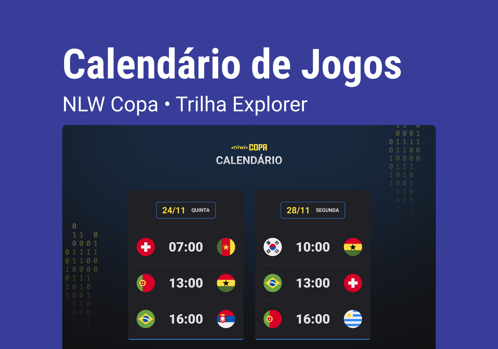

Projeto construído do evento Next Level Week da Rocketseat.

[🔗 Clique aqui para acessar](https://jvitor22.github.io/2022-world-cup-calendar)

## 🛠️ Tecnologias

- HTML
- CSS
- JavaScript
- Git e Github

## 💻 Projeto

O Calendário da Copa é um projeto que mostra os jogos da Copa de 2022.

## ✏️ Layout

Você pode visualizar o layout do projeto através [desse link](<https://www.figma.com/file/VLBESwqDyt2SNbjB5QL7Mt/Calend%C3%A1rio-de-Jogos-(Community)-(Community)?node-id=0%3A1>).

## 📧 Contato

j.vitor.a@gmail.com
